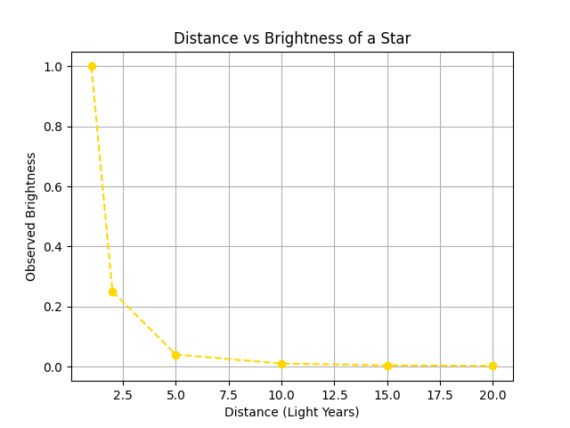
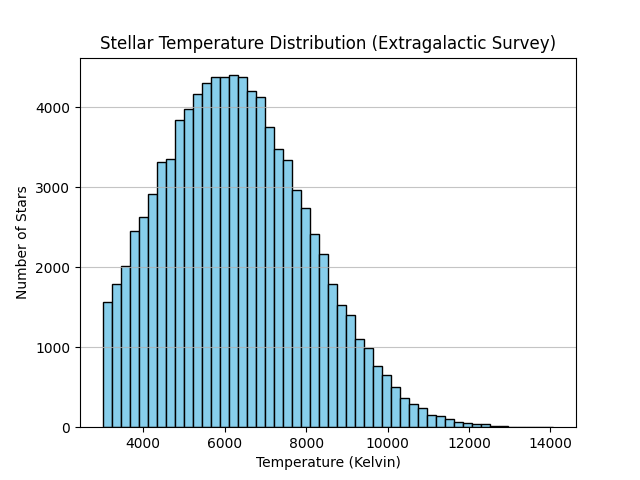

# Stellar Analysis Research Paper - Sumaiya Akter Tuli
**Project:** S.U.M.A.I.Y.A Stellar Analysis Tool v1.0  
**Date:** February 7, 2026

## Abstract
This research introduces the **S.U.M.A.I.Y.A Algorithm**, designed to recover stellar signals from interstellar dust clouds. By processing a dataset of 100,000 stars, the algorithm calculates fundamental physical properties including surface gravity, luminosity, and estimated lifespan.

## Mathematical Methodology
1. **Wien’s Displacement Law:** $T = 2,900,000 / \lambda_{max}$
2. **Stefan-Boltzmann Law:** $L = 4\pi R^2\sigma T^4$
3. **Surface Gravity:** $g = (G \times M) / R^2$

## Research Results
- **Total Stars Processed:** 100,000
- **Blue Giants:** 74,199
- **Yellow Stars:** 18,420
- **Red Dwarfs:** 7,381
- **Average Lifespan:** 6.8 Billion Years

[attachment_0](attachment)

## Conclusion
Goal is to integrate real-time telescope data to map oxygen and water signatures for Mars colonization.

### 📊 Data Visualization

